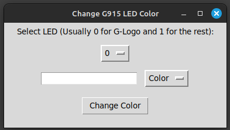

#### Important: Change the path/user in ***G915.sh*** to match your environment. Saved path/user is a default placeholder. The function *'check_script_permissions'* can be deleted to prevent the app from prompting you for permission if you don't want to use the G915.sh shortcut.
### The default-rainbow-crap state the G915 entered after sleep/press a button/whatever annoyed me so hard I created this app. Hope it helps. No other method really worked unfortunately. [womanonrails](https://womanonrails.com/logitech-g915-tkl) was the inspiration for this small app. Thanks.

# Change G915 LED Color

This Python application allows you to change the LED color of your Logitech G915 keyboard using `ratbagctl`. It provides a graphical interface for selecting LEDs and setting their colors, including predefined and custom color codes.

## Features

- **Check Dependencies**: Automatically checks if `ratbagctl` is installed. Prompts the user to install it if missing.
- **Script Permissions**: Checks if `G915.sh` is executable and prompts the user to change permissions if necessary.
- **LED Selection**: Allows the user to select which LED to modify (e.g., LED 0 for G-Logo, LED 1 for the rest).
- **Color Selection**: Provides a dropdown menu with predefined colors and their corresponding codes.
- **Custom Color Codes**: Supports entering custom color codes directly into the input field.
- **Clear Input Field**: Automatically clears the color input field after changing the color.

## Usage

1. **Ensure Dependencies**:
    - Install dependencies if prompted.
    
2. **Set Script Permissions (Can be deleted/excluded)**:
    - Make `G915.sh` executable if prompted (This is for easy access like create a link to desktop)

3. **Run the Application**:
    ```bash
    python3 change_color.py
    ```

4. **Select LED**:
    - Choose the LED to modify from the dropdown menu.

5. **Select or Enter Color**:
    - Choose a color from the dropdown menu or enter a custom color code.

6. **Change Color**:
    - Click "Change Color" to apply the new color to the selected LED.
    - Enter [custom hex color](https://www.rapidtables.com/web/color/RGB_Color.html) codes directly into the input field.


## Predefined Colors

- White
- Black (OFF)
- Grey
- Red
- Green
- Blue
- Yellow
- Cyan
- ...

## Ideas
- This could be optimized for a lot more devices, but I just wanted a quick solution while setting up Mint.

## Screenshot


