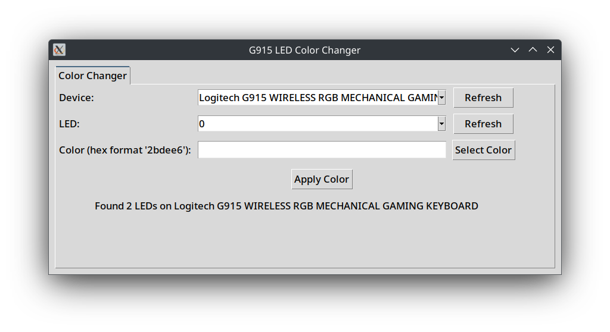

# G915 LED Color Changer

This simple App/GUI allows you to change the LED color from the default profile of your Logitech G915 keyboard using `ratbagctl`.  
The OEM rainbow-vomit setting is something that should be mentioned on the Geneva Conventions.

## Features
- **Multi-Distro**: Updated to work with `apt, pacman, dnf, zypper or flatpak`.
- **Dependency Check**: Ensures `ratbagctl` is installed, with prompts to install if missing.
- **LED Selection**: Choose which LED to modify (Usually `LED 0 for G-Logo` & `LED 1 for Keys`).
- **Color Selection**: Color selector for the full RGB spectrum.
- **Custom Codes**: Supports manual input of hex color codes (format: `2bdee6`).

## Usage
1. **Install Dependencies**: Follow prompts or manually install `ratbagctl`, if not already installed.
2. **Connect Keyboard**: Make sure your G915 is physically connected to the PC.
3. **Run the App**:
   ```bash
   python3 change_color.py
   ```
4. **Select LED**: Choose the LED to modify from the dropdown.
5. **Choose/Enter Color**: Select a color via color selector.
6. **Apply Changes**: Click "Apply Color" to update the LED.

## Important
This Color Selector **WILL OVERWRITE** the default `profile 0`, which is active when you use the G915 on a device without installing software like Piper.

## Notes
- Inspired by [womanonrails](https://womanonrails.com/logitech-g915-tkl). Bless people who care.

## Ideas
This app can be extended for other devices but was created as a quick solution for the G915 keyboard. Maybe I will update it to work with other Logitech devices.

## Image
