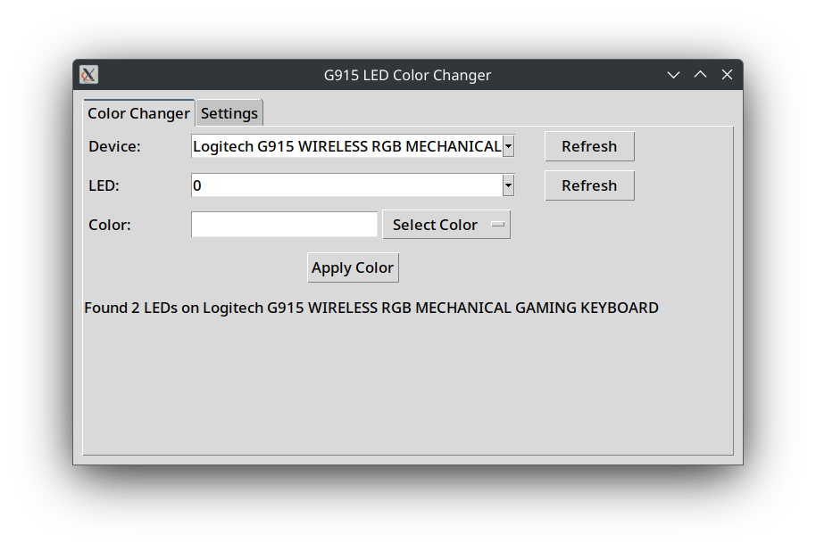

# Change G915 LED Color

This Python app allows you to change the LED color of your Logitech G915 keyboard using `ratbagctl`. It provides a simple GUI for selecting LEDs and setting colors, including predefined and custom color codes.

## Features
- **Dependency Check**: Ensures `ratbagctl` is installed, with prompts to install if missing.
- **LED Selection**: Choose which LED to modify (e.g., LED 0 for G-Logo, LED 1 for others).
- **Color Selection**: Dropdown menu with predefined colors or enter custom hex codes.
- **Custom Codes**: Supports manual input of hex color codes.

## Usage
1. **Install Dependencies**: Follow prompts to install `ratbagctl` if not already installed.
3. **Run the App**:
   ```bash
   python3 change_color.py
   ```
4. **Select LED**: Choose the LED to modify from the dropdown.
5. **Choose/Enter Color**: Select a predefined color or input a custom hex code.
6. **Apply Changes**: Click "Change Color" to update the LED.

## Predefined Colors
- White
- Black (OFF)
- Grey
- Red
- Green
- Blue
- Yellow
- Cyan
- Magenta
- Orange
- Purple
- Dark/Light Variants of Colors

## Notes
- Inspired by [womanonrails](https://womanonrails.com/logitech-g915-tkl).

## Ideas
This app can be extended for other devices but was created as a quick solution for the G915 keyboard.

## Image
